# システムの利用方法

## 1. 外部変形実行
  ### ・ 方法1: その他 → 外部変形
  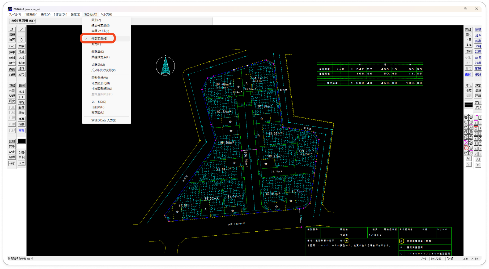

  ### ・ 方法2: ウィンドウ内のコマンド「外変」
  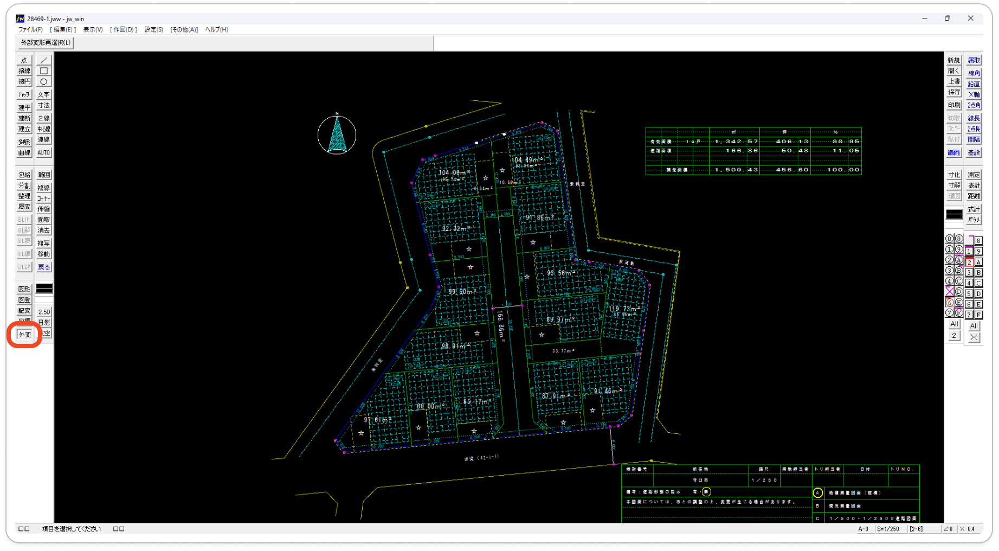

## 2. バッチファイル選択
  - **jww/parcel_allcation/src** にある「自動区画割.bat」をダブルクリック
    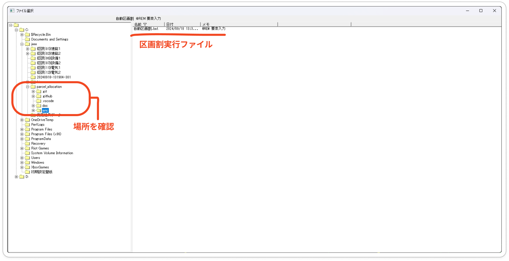

## 3. 図面上の道路を選択
### 目的
- 図面作成時に**道路に接している辺として扱う辺**を入力する

  > [!TIP] 
  > 道に面している道路を**反時計回りに選択**する\
  > 選択は道路の始点・終点に二点を選択することで１本の道路とみなす

### 手順
  - jww左上のコマンド「道路選択」を選択
    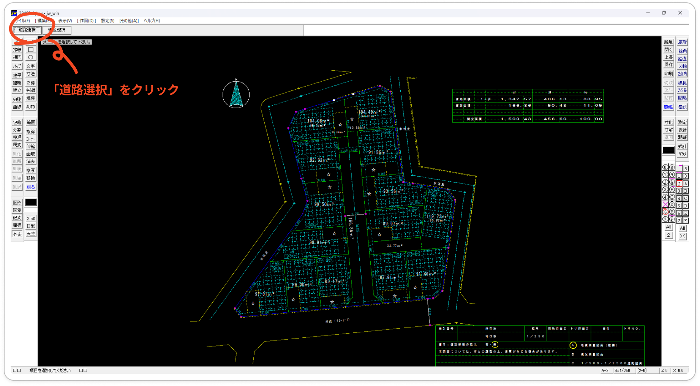

  - 辺の始点と終点を**右クリック**で選択
    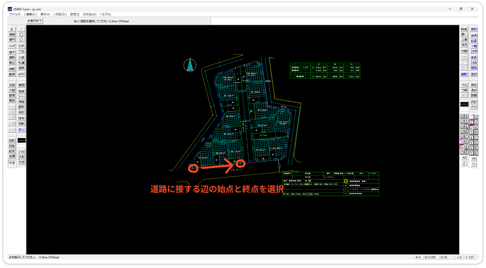
  - 全ての道路選択後「選択終了」を選択
    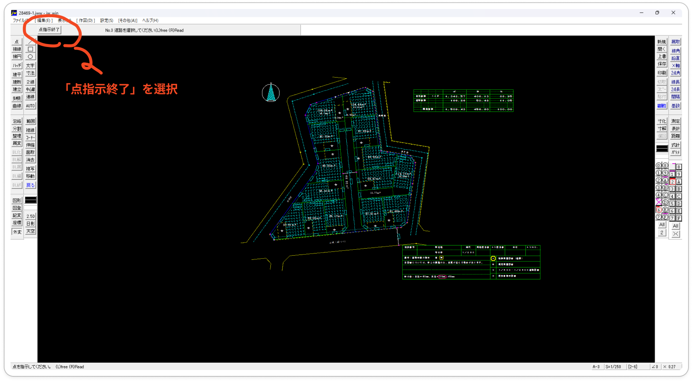

## 4. 間口の入力
### 目的
  - 許容できる間口の最大値・最小値を入力する
  - 両方未入力や片方未入力でも可

### 手順
  - 計算に使用する最小の間口を入力（未入力で7m）
    
  - 計算に使用する最大の間口を入力（未入力で8m）
    

## 5. 目標面積の入力
  ### 目的
  - 計算に使用する最小面積を入力（未入力で100㎡）
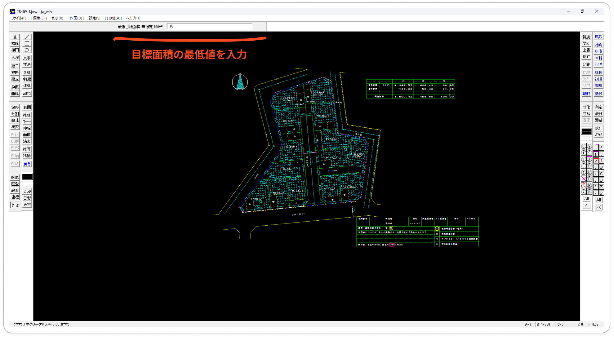
  - 計算に使用する最大面積を入力（未入力で120㎡）

## 6. jww左上のコマンド「街区選択」を選択
### 目的
  - 計算に使用する街区（図面の外枠）を選択する
  
  > [!TIP] 
  > 街区を構成する辺を**反時計回りに選択**する\
  > 選択は道路の始点・終点に二点を選択することで１本の道路とみなし、それらを一周することで図形を構成する

### 手順
  - jww左上のコマンド「街区選択」を選択
  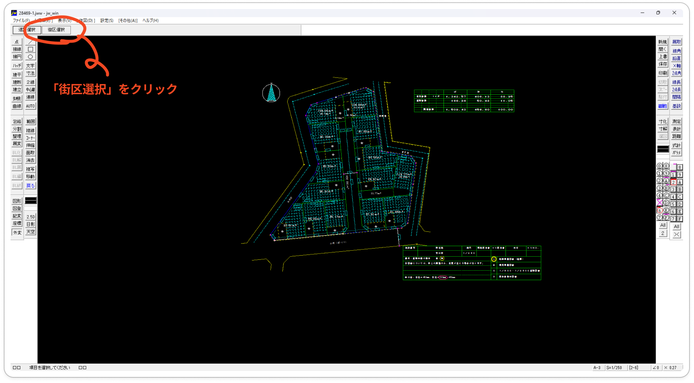

  - 街区を構成する辺を反時計回りの方向から順々に選択
  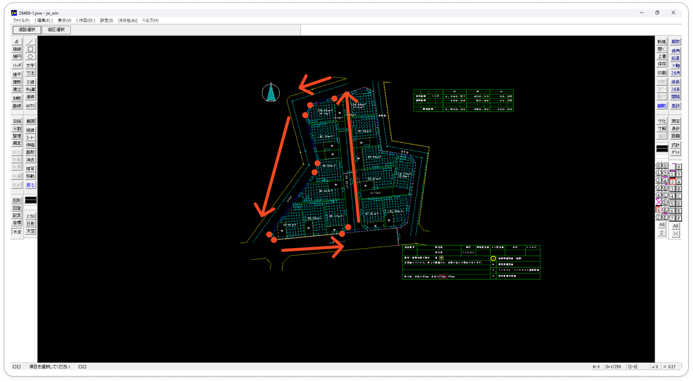

  - 全ての辺を選択後「点指示終了」を選択
  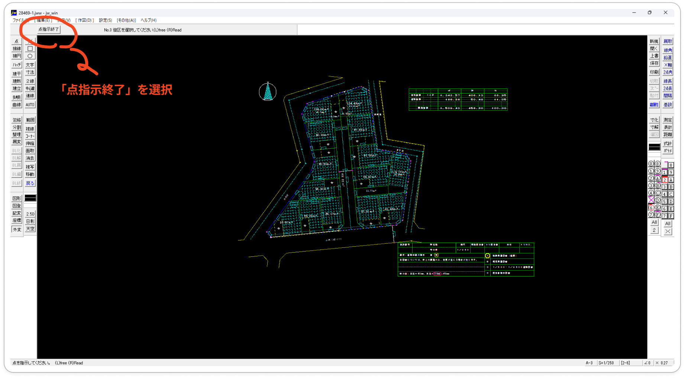

## 7. 分割結果を確認
  - C:\jww\parcel_allocation\src\out に保存されている結果を確認
  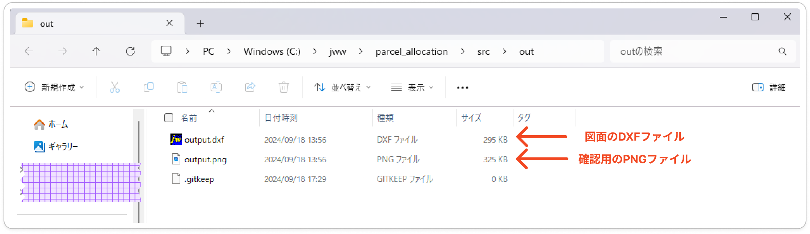