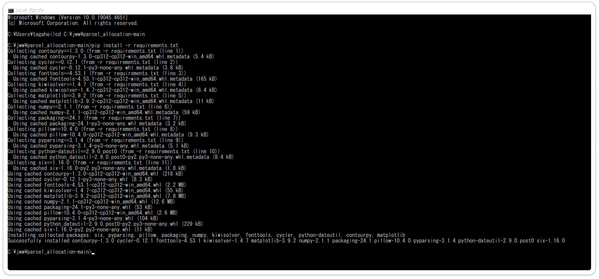

# システム利用における環境構築

- [システム利用における環境構築](#システム利用における環境構築)
	- [1. jw\_CADのインストール](#1-jw_cadのインストール)
	- [2. システムのプログラムのダウンロード](#2-システムのプログラムのダウンロード)
		- [2.1 zipファイルダウンロード](#21-zipファイルダウンロード)
		- [2.2 プログラムファイルの設置](#22-プログラムファイルの設置)
	- [3. Pythonインストール](#3-pythonインストール)
	- [4. パッケージのインストール](#4-パッケージのインストール)
		- [4.1 コマンドプロンプトの起動](#41-コマンドプロンプトの起動)
		- [4.2 パッケージインストール](#42-パッケージインストール)


## 1. jw_CADのインストール

下記のページからjw_cadをインストールしてください

- [Jww_cadインストールページ](https://www.jwcad.net/download.htm)

## 2. システムのプログラムのダウンロード

本システムのプログラムを下記サイトからダウンロードします

- 使用するプログラム：https://github.com/FUJI-CORPORATION-GROUP/parcel_allocation/tree/main

### 2.1 zipファイルダウンロード
本システムのソースコードが公開されている[サイト](https://github.com/FUJI-CORPORATION-GROUP/parcel_allocation/tree/main)にアクセスし，下記画像のようにzipファイルをダウンロードします


### 2.2 プログラムファイルの設置

ダウンロードしたzipファイルを`C:¥jww`内で解凍します.


下のようなファイル構造になっていれば完了です．

```
C:jww
└─parcel_allocation-main
    ├─.github
    ├─.vscode
    ├─doc
    └─src
```

## 3. Pythonインストール

下記ページの指示に従って，pythonをインストールしてください．
基本は最新バージョンで問題ないと思われます．

- [**Pythonのダウンロードとインストール方法**](https://www.javadrive.jp/python/install/index1.html)
- [**python公式ページ**](https://www.python.org/)


## 4. パッケージのインストール

### 4.1 コマンドプロンプトの起動

- windowsのタスクバーの検索ボックスに「cmd」と入力して検索
- windowsアプリ一覧から「Windowsシステムツール」の中のコマンドプロンプトをクリック

どちらかの方法で下の画像のウィンドウが表示されたら起動完了です．


### 4.2 パッケージインストール

下記のコードをコピーしてコマンドプロンプトに張り付けて実行してください

```
cd C:\jww\parcel_allocation-main
pip install -r requirements.txt
```

下記画面のように実行が完了すればセットアップの完了です


