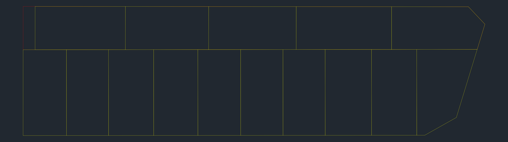
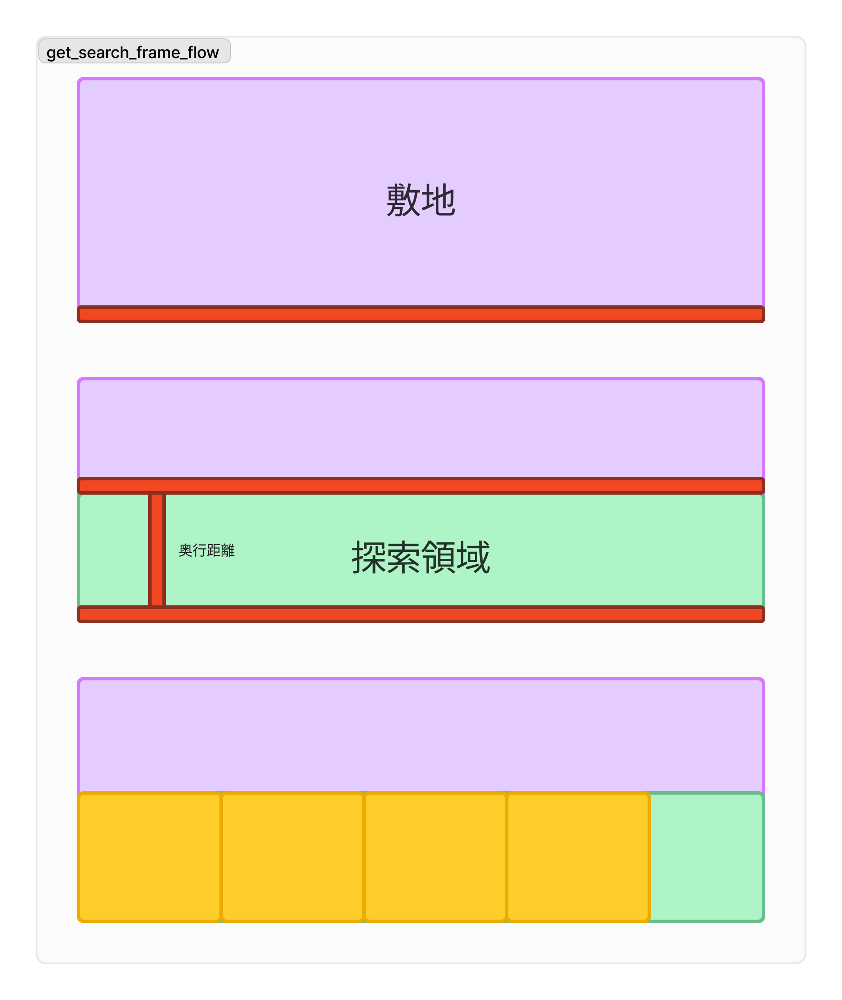
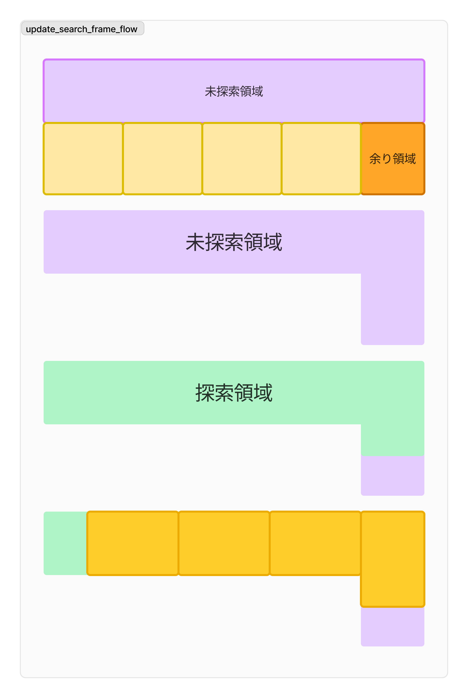

# 2024 0524 打合せ

## 進捗報告

- 探索領域の決定
- 複数の辺に対応した区画割

### 実行結果

ただし，5回に1回ぐらいしか実行できない．
原因解明済みのため，対応中です

### 機能概要

#### 探索領域取得

1. 探索領域の奥行距離の決定
   1. 目標面積(min-max), 目標間口(min-max)から算出
   2. 奥行 = 目標面積 / 目標間口
2. 探索領域の決定
   1. 対象道路から算出した奥行の距離に道路と平行の直線を配置
   2. 直線で区切られる領域を探索領域として取得
3. 二分探索で区画割実行
   1. 取得した探索領に対して二分探索を用いて区画割

#### 探索領域更新

1. 区画割済み探索領域の余り領域の取得
2. 敷地の未探索領域の取得
3. 「余り領域」と「未探索領域」から次の探索候補領域の取得
4. 対象道路を変更して，探索領域の取得
5. 区画割の実行

## 今回の議題

- 複数結果出力時の図面の選定方法について
  - 最終的に出力する図面の数
  - 個々の探索領域の選定基準

### 例

条件：最終的に決定する図面の数30枚，道路の数2本

1. パラメータの入力
2. 1本目の道路に対して区画割を実行
3. 30件の実行結果を生成
4. 暫定の結果を評価 -> **この際，2本目の分割を行う結果を選定**
5. 2本目の道路・選定された区画に対して区画割を実行
6. 30件の実行結果を生成
7. 全体の結果を評価
8. 必要に応じてソートし，描画

### 具体的な選定方法

- 案1 全パターンを計算する
  - それぞれ認定した（30件など）数を計算する
  - 道路が2本なら900件，3本なら2700件の結果がでる
  - 全パターンから評価・選定して上位数件を描画\
    →識別できるだけの要素や条件が必要？とはいえ，ランダムでも可

- 案2 面積ベースで，上位1件のみ選定
  - 下位の結果は歪なものが多いことが予想される
  - とにかく面積にこだわって，最後の道路においては複数の結果を出す

- 案3 上位数件ずつ（3~5を想定）を選定
  - 上位数件を対象としていくつかの分割結果を算出
  - 道路の数に応じて指数関数的に結果が増えるため，\
  辺が1~3本の場合の使用に制限

- 案4 最終描画数に対して逆算して計算
  - 最終的な描画数を30等に設定する
  - それに対しての辺の本数を逆算し，計算する数を決定する\
    →2本なら5ずつ，3本なら3ずつ

## 今後の方針

- バグ修正
- 他の図面への挑戦（マスト）
- 複数結果の表示
- 評価要素の選定

