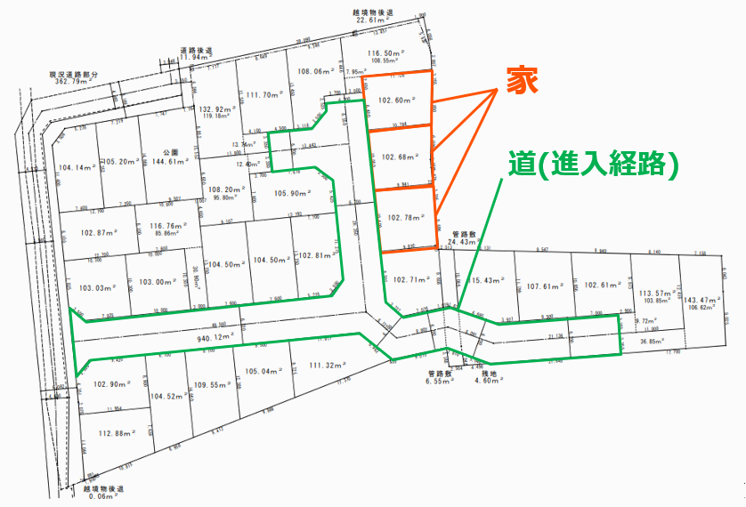
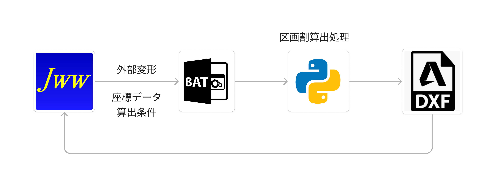
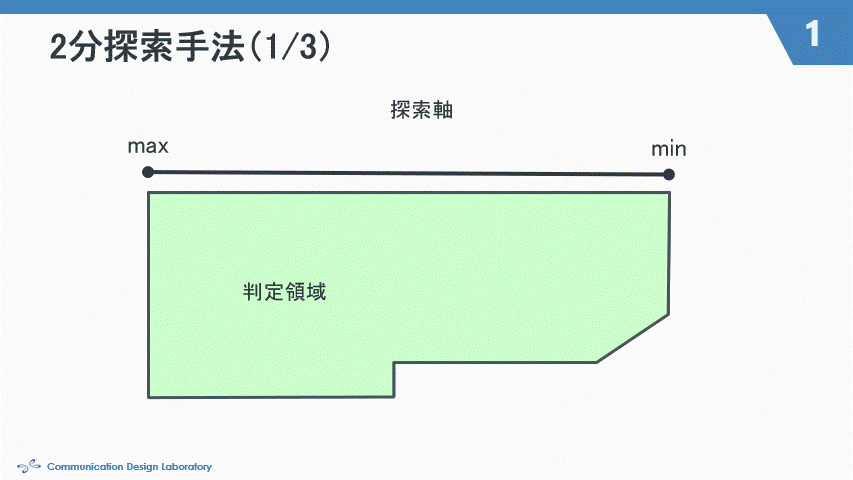

# 2024/0704 システム説明

目次
- [2024/0704 システム説明](#20240704-システム説明)
  - [本システムの目的](#本システムの目的)
    - [システム全体の目的](#システム全体の目的)
    - [現状のシステムの立ち位置](#現状のシステムの立ち位置)
  - [区画割システム](#区画割システム)
    - [システム構成](#システム構成)
    - [区画割手法の概要](#区画割手法の概要)
    - [具体的な処理の流れ](#具体的な処理の流れ)
      - [1. パラメータの入力](#1-パラメータの入力)
      - [2. 指定範囲から探索領域の取得](#2-指定範囲から探索領域の取得)
      - [3. 二分探索による区画割](#3-二分探索による区画割)
      - [4. 残存街区の取得](#4-残存街区の取得)
      - [5. 探索領域の取得](#5-探索領域の取得)
      - [6. 二分探索による区画割（以下繰り返し）](#6-二分探索による区画割以下繰り返し)
      - [7. 完成図面描画](#7-完成図面描画)
      - [8. コピーペーストによる実務図面への適用](#8-コピーペーストによる実務図面への適用)
  - [今後](#今後)

## 本システムの目的

実務において，設計士の方々が手動で行っている区画割図(下図)作成を自動化する．

<!-- TODO: システムの目的 -->
### システム全体の目的

> [!IMPORTANT]
> - 区画割業務の効率化
> - より効率の良い図面の生成
> 
> -> **街区図面とパラメータの入力**から**複数の区画割図**の生成

### 現状のシステムの立ち位置
- 区画割図生成ロジックの作成
  - **進入道路の必要ない図面**に対する**区画割パターン**の算出

## 区画割システム

### システム構成

​

- jwwCAD
  - フジ住宅側が業務で使用しているCAD編集ツール
  - jwwCad内の「外部変形」を使い任意のBatファイルを実行
  - Batファイルでデータの入力とPython実行
- dxf
  - 出力した区画割結果を表示

### 区画割手法の概要
- 区画割とは，**目標面積**に基づいて区画を作成していく作業のこと．
- 本システムでは作成に**二分探索**を使用し，入力された間口と面積から区画を決定する
  - 整形ではない図面に対する均等分割
- 区画割作成は道路に接している辺から実行し，道路の数だけ繰り返す．

​

### 具体的な処理の流れ

1. パラメータの入力
2. 指定範囲から探索領域の取得
3. 二分探索による区画割
4. 残存街区の取得
5. 探索領域の取得
6. 二分探索による区画割（以下繰り返し）
7. 完成図面描画
8. コピーペーストによる実務図面への適用

#### 1. パラメータの入力
- CAD上で外部変形を選択し，指示に従ってパラメータを入力する
- 入力項目は以下
  - 道路の座標２点×本数
  - 目標面積の最大・最小
  - 目標間口の最大・最小
  - 街区を構成する全ての頂点
  

  d

#### 2. 指定範囲から探索領域の取得
1. 探索領域の奥行距離の決定 
    -  目標面積(min-max), 目標間口(min-max)から算出
    -  奥行 = 目標面積 / 目標間口
2. 探索領域の決定
    -  対象道路から算出した奥行の距離に道路と平行の直線を配置
    -  直線で区切られる領域を探索領域として取得

#### 3. 二分探索による区画割
1. 二分探索で区画割実行
   - 取得した探索領に対して二分探索を用いて区画割

#### 4. 残存街区の取得
1. 区画割済み探索領域の余り領域の取得
2. 敷地の未探索領域の取得
3. 「余り領域」と「未探索領域」から次の探索候補領域の取得
4. 対象道路を変更して，探索領域の取得
5. 区画割の実行

#### 5. 探索領域の取得
- 手順2と同様に，動的に計算した奥行距離から探索領域を決定する

#### 6. 二分探索による区画割（以下繰り返し）
- 手順3と同様に，目標面積範囲・目標間口範囲を基準に二分探索を実行する

#### 7. 完成図面描画
- 出力用ファイル（output.dxf）に分割結果を描画
- 現状では区画割結果を黄線，既存街区を赤線で描画
  

> [!IMPORTANT]
> ただし，5回に1回ぐらいしか実行できない．原因解明済みのため，対応中です

#### 8. コピーペーストによる実務図面への適用
- 出力されたファイル（output.dxf）から，実務で使用しているファイルへコピペして反映が可能

## 今後
- 機能面
  - 他の図面への対応
  - 効率の良い図面の評価処理
    - 効率の良さの定量化
    - 制約条件
  - 進入道路を考慮した区画割ロジックの検討
- 環境面
  - jwwCADから離れる？
    - 使いやすいUI
  - Web上で動かす？
    - メンテナンスのしやすさ
