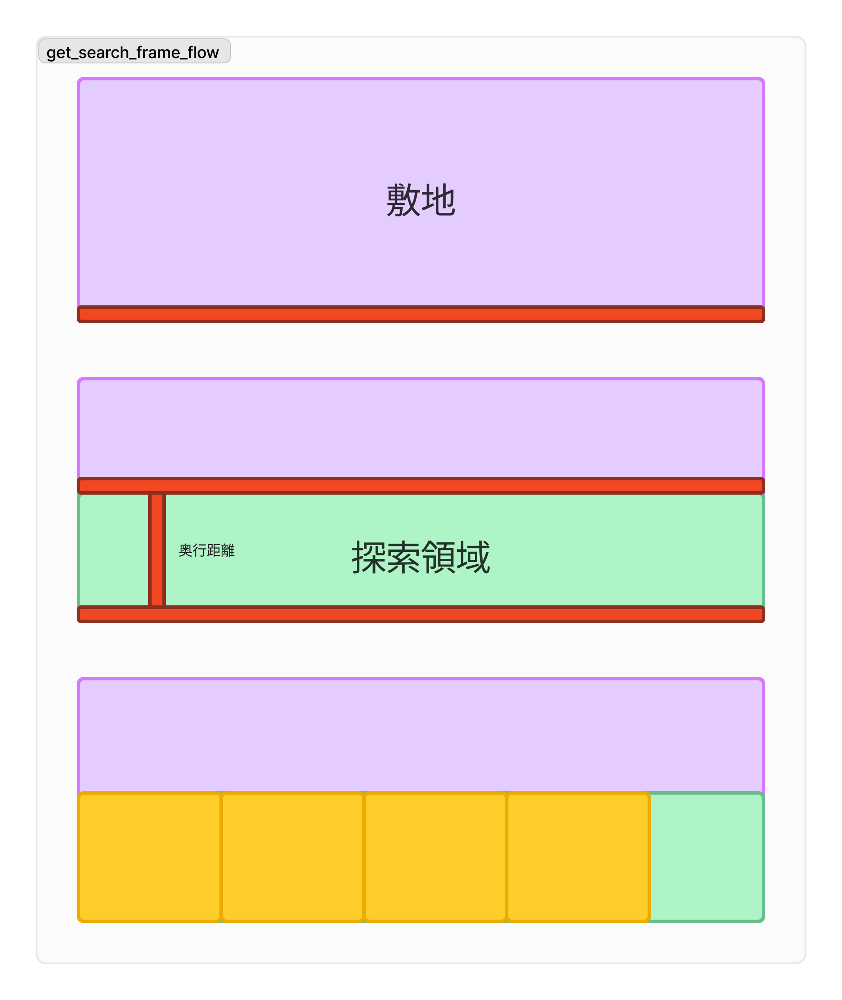
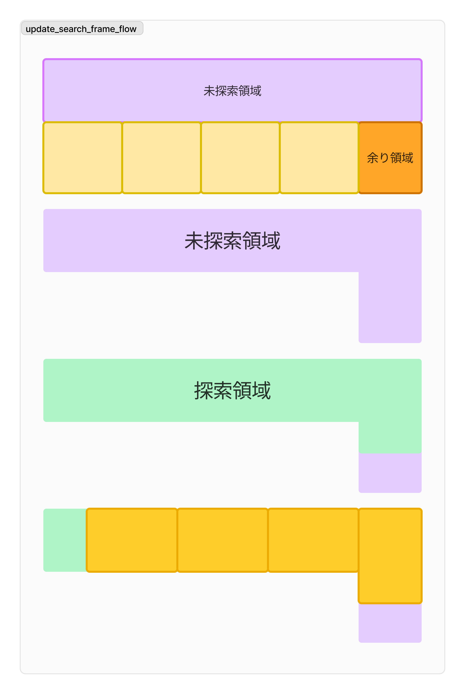

# 打ち合わせ内容 7/4

## 目次
- システムの全体像の想定
- システムの現状
- システムの問題点
- 実行環境について

## システムの全体像の想定

1. 探索領域に対して区画割
2. 街区+道路に対して，探索領域を取得しく区画割
3. 街区に対して，道路の位置を最適化

### 探索領域の決定

街区から探索領域をシステム的に決定する

内側に道路ができるものを想定する場合
道路は決定済みの図面を考える

これによってできること
街区と道路の位置に対して，指定の範囲で様々なパターンの区画割が可能

### 道路の位置の最適化（夢）

その後，どこに道路を配置すべきなのかを機械的にしていく

一つの辺に対していろんな道路の入れ方を機械的に決めて，
前 Step を試して，良いパターンを提示する

いろんな道路の配置・長さ・入れ方に対して行えると理想形

これによってできること
街区に対して様々なパターンの区画割が自動で可能

### 探索領域の取得をどうするか

具体的な探索領域の取得手法について考えたため下記に示す

探索領域の決定方法

- 軸とする道路を決定
- 範囲内のランダムな間口を決定
- 間口から奥行距離を決定
- 軸から平行な直線を奥行距離として配置

→ これによって探索領域が確定する

その他，細かい条件下での対応について

- 複数基準線が存在する図面に関しては順序を無作為に決定して区画割
- 二分探索時，複数の方向からの分割が考えられる場合は奥から
- 間口は最小と最大を入力することを想定
- 計算結果は，不可能なものを排除した複数結果の提示を想定

## システムの現状

### 具体的な流れ

1. パラメータの入力
2. 指定範囲から探索領域の取得
3. 二分探索による区画割
4. 残存街区の取得
5. 探索領域の取得
6. 二分探索による区画割（以下繰り返し）
7. 完成図面描画
8. コピーペーストによる実務図面への適用

#### 1. パラメータの入力
道路の座標２点×本数
目標面積の最大・最小
目標間口の最大・最小
街区を構成する頂点を全て

#### 2. 指定範囲から探索領域の取得
1. 探索領域の奥行距離の決定 
    -  目標面積(min-max), 目標間口(min-max)から算出
    -  奥行 = 目標面積 / 目標間口
2. 探索領域の決定
    -  対象道路から算出した奥行の距離に道路と平行の直線を配置
    -  直線で区切られる領域を探索領域として取得

#### 3. 二分探索による区画割
3. 二分探索で区画割実行
   1. 取得した探索領に対して二分探索を用いて区画割

#### 4. 残存街区の取得
1. 区画割済み探索領域の余り領域の取得
2. 敷地の未探索領域の取得
3. 「余り領域」と「未探索領域」から次の探索候補領域の取得
4. 対象道路を変更して，探索領域の取得
5. 区画割の実行

#### 5. 探索領域の取得

#### 6. 二分探索による区画割（以下繰り返し）
フロー3と同様に，目標面積範囲・目標間口範囲を基準に二分探索を実行

#### 7. 完成図面描画
出力用ファイル（output.dxf）に分割結果を描画

現状では区画割結果を赤線，既存街区を黄色戦で描画

＊ただし，5回に1回ぐらいしか実行できない．
原因解明済みのため，対応中です

#### 8. コピーペーストによる実務図面への適用
出力されたファイル（output.dxf）から，実務で使用しているファイルへはコピペで反映が可能

## システムの問題点（書いててこれいらんくね？ってなった）

- バグ修正
マルチポリゴンの話

- 図面の複数描画について
全パターンを計算する
  - それぞれ認定した（30件など）数を計算する
  - 道路が2本なら900件，3本なら2700件の結果がでる
  - 全パターンから評価・選定して上位数件を描画\
    →識別できるだけの要素や条件が必要？とはいえ，ランダムでも可

- 評価要素の選定
現状では面積しかない話

## 実行環境について

### 現在発生している懸念点・問題

- 開発環境の準備がかなり面倒
- システムをアップデートするときに特に面倒

### 解決案

> **Web 上で動くシステムにする**

- メリット

  - 開発者が直接変更をすぐに反映できる環境構築などがだいぶ楽（だと思われる）

- 懸念点
  - 環境が変わる場合実装コストは少しある（ロジックは同じ）
  - dxf からのデータ入力
    - 外部変形との連携 or 新しく考える
  - サーバが必要
    - 無料もあるが，大量に使う場合などは金銭が派生する可能性がある
  - 安全性
    - 図面をそのまま上げない方法の検討が必要
      - 抽出した座標
