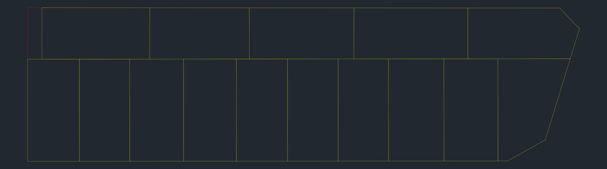

# 2024/0918 打ち合わせ

- [2024/0918 打ち合わせ](#20240918-打ち合わせ)
  - [進捗](#進捗)
    - [実装内容](#実装内容)
    - [実行結果](#実行結果)
  - [現状のシステム](#現状のシステム)
  - [現状の課題](#現状の課題)
  - [実用化に向けて](#実用化に向けて)

## 進捗

### 実装内容

- multi ポリゴン
- 複数パターン出力できるよう

### 実行結果

- 前回出せてた図面
- 

  > [!IMPORTANT] > 前回までは 5 回に 1 回ぐらいしか実行できなかった．原因解明後，対応済みです

- 今回出せてた図面
  - 複数パターン
  - 複数図面で試したよ

| 入力図面                                | 出力図面                                     |
| --------------------------------------- | -------------------------------------------- |
|  |  |
|  |  |

## 現状のシステム

- 使用できる図面
  - 進入経路がない図面
  - 進入経路入力後の図面（の一部分）

## 現状の課題

- 使えない図面

  - ただただ広くて複雑なもの
  - 長い道路の途中に頂点がある場合のやつ
  - 間口の保証ができないほど歪な図面
  - 旗竿地が必要な図面

- 機能面の問題
  - 小数点問題
    - 入力時にパラメータが少数点になりエラーが出たりする
  - 入力ミスったら終わり問題
    - エラーかどうか，正常に終わったかどうかがわからないのがきつそう
    - システムとしての開発ではなく手法を現在模索している状態のため

## 実用化に向けて

- **使える図面の選別（＝評価指標）**
  - 評価指標の検討
    - 区画数以外（面積・間口の広さ・向き？）
  - 評価機能の実装
  - 評価内容の表示（数値等）
- **使えない図面の選別（=制約条件）**
  - 間口条件
- 入力をもっとやりやすく
